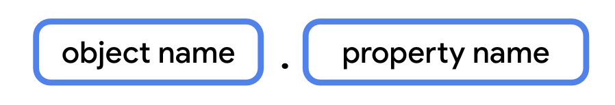

# GenericsObjectsExtension
Best Practices

When you want a property to have differing data types, subclassing is not the answer. 
Instead, Kotlin provides something called `generic types` that allow you to have a single property that can have differing `data types`, depending on the specific use case.


Change Repetiton:
```
class fillInBlanckQuestion{class FillInTheBlankQuestion(
    val questionText: String,
    val answer: String,
    val difficulty: String
)
class TrueOrFalseQuestion(
    val questionText: String,
    val answer: Boolean,
    val difficulty: String
)
class NumericQuestion(
    val questionText: String,
    val answer: Int,
    val difficulty: String
)
```
To Generic: 

```
class Question<T>(val question: String, val answer: T, val difficulty: String) {
}
```
Now we can have:

```
    val question1 = Question<String>("Quoth the raven ___", "nevermore", "medium")
    val question2 = Question<Boolean>("The sky is green. True or false", false, "easy")
    val question3 = Question<Int>("How many days are there between full moons?", 28, "hard")
```
Use Enum classes to model types that represent a finite set of distinct values, such as directions, states, modes, and so forth.


### Enum Classes

An `enum` class is a class that has a fixed set of values.
Enum classes are used to represent a fixed set of values, such as the days of the week, the months of the year, or the different states of a game.
Enum classes are used to model types that represent a finite set of distinct values, such as directions, states, modes, and so forth.

```
enum class Direction {
    NORTH,
    SOUTH,
    EAST,
    WEST
}
enum class State {
    IDLE,
    RUNNING,
    JUMPING,
    FALLING
}
enum class Mode {
    NORMAL,
    HARD,
    INSANE
}

enum class Difficulty {
    EASY, MEDIUM, HARD
}
val question1 = Question<String>("Quoth the raven ___", "nevermore", Difficulty.MEDIUM)
val question2 = Question<Boolean>("The sky is green. True or false", false, Difficulty.EASY)
val question3 = Question<Int>("How many days are there between full moons?", 28, Difficulty.HARD)
```

### Data Classes

``` 
data class Question<T>(val questionText: String, val answer: T, val difficulty: Difficulty) {
}

val question1 = Question<String>("Quoth the raven ___", "nevermore", Difficulty.MEDIUM)
val question2 = Question<Boolean>("The sky is green. True or false", false, Difficulty.EASY)
val question3 = Question<Int>("How many days are there between full moons?", 28, Difficulty.HARD)

```

### Data Class and Enum Class

```
 data class Question<T>(
    val questionText: String,
    val answer: T,
    val difficulty: Difficulty
)
 enum class Difficulty {
    EASY, MEDIUM, HARD
}   

fun main() {
    val question1 = Question<String>("Quoth the raven ___", "nevermore", Difficulty.MEDIUM)
    val question2 = Question<Boolean>("The sky is green. True or false", false, Difficulty.EASY)
    val question3 = Question<Int>("How many days are there between full moons?", 28, Difficulty.HARD) 
	println(question1.toString())
}
```
When you use a data class, 
toString()
equals()
hashCode()
copy()
componentN():component1(), component2(), component3()
and other methods are automatically generated.

A data class is a class that has a primary constructor and a collection of properties.
Dataclass cannot be abstract or open or sealed.

### Singleton Objects

Singleton objects are objects that are instantiated only once.
Example:
Data source of the application.
Interacting with a single hardware device like sending audio to a speaker.
Player stats in a game for the current user.
An object to access remote data source like a database.
To track the current state of the quiz being taken by a particular user.
A singleton object can't have a constructor

```
object StudentProgress {
    var currentQuestion: Int = 0
    var totalQuestions: Int = 0
    var correctAnswers: Int = 0
    var incorrectAnswers: Int = 0
    var totalTime: Long = 0
    var answered: Int = 0   
}
```
Accesing the object properties:



```
fun main() {
    ...
    println("${StudentProgress.answered} of ${StudentProgress.total} answered.")
}
```
- Companion Object
- Companion Object is a singleton object that is created when a class is loaded.
- You can define a singleton object inside another class using a companion object

You can create a new class called Quiz to store the quiz questions, then make the 
StudentProgress class a companion object of Quiz.


